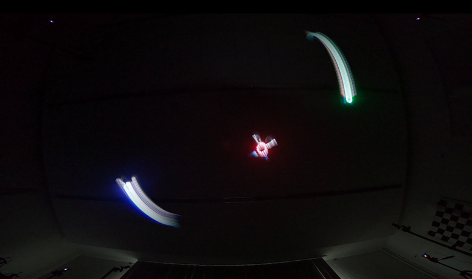

# drone_swarm
Programming Crazyflie drone swarms via CSV files.
This uses the [Loco positioning system](https://www.bitcraze.io/documentation/system/positioning/loco-positioning-system/).

Included :
- Drone moves
- RGB LED variations
- Headlight LED variations

**More details in the[ .pdf file.](https://github.com/loickt/drone_swarm/blob/main/user_manual.pdf)**

***
Click on the above picture to see the video
***